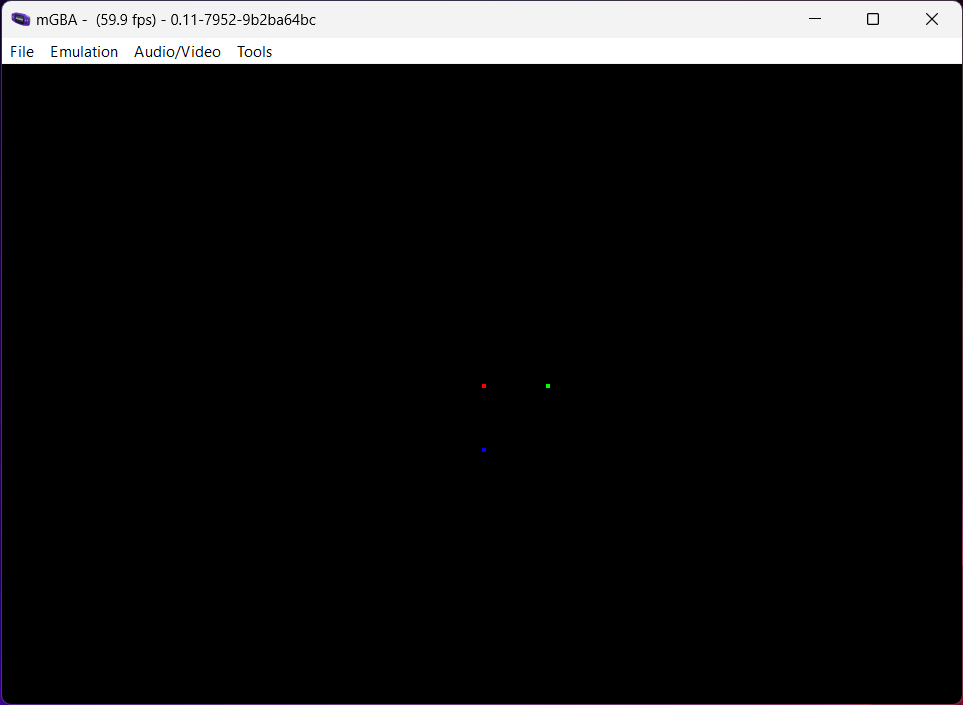

# Project Setup

Now that we have everything ready to go, let's set up meson-gba.

First, navigate your terminal to wherever you like to keep your programming projects.

Then, download meson-gba using git, if you haven't already done so:

```sh
git clone https://github.com/LunarLambda/meson-gba
cd meson-gba
```

If you type `ls -1`, you should see the following files:

```
LICENSE.txt
README.md
book
examples
game
gba.ini
meson
meson.build
subprojects
```

The `game` directory is where you will place all your game's code and files. The `meson` directory contains files needed for configuring the compiler, and the `subprojects` directory contains files for all the libraries and programs that meson-gba lets you use.

Finally, you can configure some project settings in `meson.build`, although this is optional, most of your build code will be in `game`.

Set up your build directory:

```sh
meson setup --cross-file=gba.ini build
```

If everything goes well, you should see something like this at the end:

```
gba-meson 0.5.0

  Subprojects
	sdk-seven  : YES

  User defined options
    Cross files: gba.ini
```

[sdk-seven](https://github.com/LunarLambda/sdk-seven) is the project that provides all the necessary bits for building GBA programs (or ROMs).

Now, you should be able to compile everything:

```sh
ninja -C build
```

If you look inside the `build/game` directory, you should now see a file called `gba-meson-template.gba`. Let's try running it in an emulator:



Success!